# RC Release Management

This document provides two perspectives on the RC (Release Candidate) lifecycle: the **Developer's perspective** focusing on feature development and collaboration, and the **Release Engineer's perspective** focusing on version management and deployment orchestration.

## Table of Contents
- [Developer's Perspective](#developers-perspective)
- [Release Engineer's Perspective](#release-engineers-perspective)
- [Key Interactions](#key-interactions)
- [Scripts and Detailed Workflow](./docs/rc-release-scripts.md)
- [CI/CD Integration](./docs/ci-cd-integration.md)

---

## Developer's Perspective

From a developer's standpoint, the lifecycle is a simple, repeatable workflow focused on feature development and collaboration.

```mermaid
%%{init: {'theme':'base', 'themeVariables': { 'primaryColor': '#2E86AB', 'primaryTextColor': '#ffffff', 'primaryBorderColor': '#2E86AB', 'lineColor': '#333333', 'secondaryColor': '#A23B72', 'tertiaryColor': '#F18F01', 'background': '#ffffff', 'mainBkg': '#ffffff'}, 'flowchart': {'nodeSpacing': 50, 'rankSpacing': 60}}}%%
flowchart TD
    Start([🎯 Ready for<br/>new work]) --> Checkout[📍 Checkout main and create branch<br/>git checkout main<br/>git checkout -b feature/EN-1234]
    
    Checkout --> Develop[💻 Write code, tests, docs<br/>Implement feature or fix]
    
    Develop --> OpenPR[📝 Open PR targeting main<br/>Pull Request created]
    
    OpenPR --> CodeReview[👥 Code review & approval<br/>Team feedback & iterations]
    
    CodeReview --> Merge[✅ Merge into main<br/>PR approved and merged]
    
    Merge --> Repeat[🔄 Repeat<br/>Next feature or fix]
    Repeat --> Start
    
    %% Styling
    classDef devNode fill:#2E86AB,stroke:#1E5F74,stroke-width:2px,color:#ffffff
    classDef processNode fill:#F18F01,stroke:#D4730A,stroke-width:2px,color:#ffffff
    classDef startEndNode fill:#2C3E50,stroke:#1B2631,stroke-width:3px,color:#ffffff
    
    class Start,Repeat startEndNode
    class Checkout,Develop,OpenPR,Merge devNode
    class CodeReview processNode
```

### Developer's Simple Workflow:
- **Branch Creation**: Checkout main and create feature/bug branches
- **Development**: Write code, tests, and documentation
- **Pull Request**: Open PR targeting main branch
- **Code Review**: Collaborate with team on code review and approval
- **Merge & Repeat**: Merge into main and start the next piece of work

---

## Release Engineer's Perspective

From a release engineer's standpoint, there are two distinct workflows: normal releases and emergency hotfixes.

```mermaid
%%{init: {'theme':'base', 'themeVariables': { 'primaryColor': '#8E44AD', 'primaryTextColor': '#ffffff', 'primaryBorderColor': '#8E44AD', 'lineColor': '#333333', 'secondaryColor': '#E67E22', 'tertiaryColor': '#27AE60', 'background': '#ffffff', 'mainBkg': '#ffffff'}, 'flowchart': {'nodeSpacing': 50, 'rankSpacing': 60}}}%%
flowchart TD
    Start([🚀 Ready to<br/>manage release]) --> ReleaseType{Release Type?}
    
    %% Normal Release Path
    ReleaseType -->|Normal Release| PromoteRC[🎯 Promote latest RC<br/>./promote_rc.sh]
    PromoteRC --> StartNewTrain[🔧 Start new RC train<br/>cut_rc.sh --version $package.json --replace]
    StartNewTrain --> NormalComplete[✅ Normal release complete]
    NormalComplete --> Start
    
    %% Hotfix Path  
    ReleaseType -->|Hotfix| CutHotfix[⚡ Cut hotfix branch from prod tag<br/>git checkout -b hotfix/fix v2.3.0]
    CutHotfix --> WriteCode[💻 Write code to fix issue<br/>Minimal change only]
    WriteCode --> BumpPatch[� Bump patch in package.json<br/>2.3.0 → 2.3.1]
    BumpPatch --> CreateTag[🏷️ Create new tag and publish<br/>git tag v2.3.1 && git push origin v2.3.1]
    CreateTag --> MergeHotfix[� Merge hotfix branch into main<br/>Directly merge or Integration via PR]
    MergeHotfix --> HotfixComplete[✅ Hotfix complete]
    HotfixComplete --> Start
    
    %% Styling
    classDef engineerNode fill:#8E44AD,stroke:#6C3483,stroke-width:2px,color:#ffffff
    classDef hotfixNode fill:#E74C3C,stroke:#C0392B,stroke-width:2px,color:#ffffff
    classDef processNode fill:#E67E22,stroke:#CA6F1E,stroke-width:2px,color:#ffffff
    classDef decisionNode fill:#3498DB,stroke:#2E86C1,stroke-width:2px,color:#ffffff
    classDef startEndNode fill:#2C3E50,stroke:#1B2631,stroke-width:3px,color:#ffffff
    
    class Start startEndNode
    class PromoteRC,StartNewTrain,NormalComplete engineerNode
    class CutHotfix,WriteCode,BumpPatch,CreateTag,MergeHotfix,HotfixComplete hotfixNode
    class ReleaseType decisionNode
```

### Release Engineer's Workflows:

#### **Normal Release**
- **Promote latest RC**: `./promote_rc.sh`
- **Start new RC train**: `cut_rc.sh --version $(node -p "require('./package.json').version") --replace`

#### **Hotfix Release**
- **Cut hotfix branch from prod tag**: Manual branch creation
- **Write code to fix issue**: Minimal changes only
- **Bump patch in package.json**: `2.3.0 → 2.3.1`
- **Create new tag and publish**: Manual tag creation
- **Merge hotfix branch into main**: Directly merge or Integration via PR

---

## Key Interactions

The two perspectives intersect at critical points:

### 🤝 **Collaboration Points**

| **Phase** | **Developer** | **Release Engineer** |
|-----------|---------------|---------------------|
| **Feature Ready** | Merges PR to main | Monitors main activity for RC triggers |
| **Staging Issues** | Fixes bugs found in staging | Communicates staging status & blocking issues |
| **Production Readiness** | Confirms features work correctly | Makes go/no-go decision for production |
| **Hotfix Required** | Implements minimal fix | Coordinates hotfix deployment & integration |

### 🔄 **Automated Handoffs**

- **PR Merge → RC Creation**: Developer merges trigger automatic RC progression
- **Production Deploy → Version Bump**: Production deployment triggers next cycle setup
- **Hotfix Tag → CI/CD**: Emergency deployments trigger automatic production workflows

### 📊 **Shared Responsibilities**

- **Staging Environment**: Both monitor for issues, developers fix, engineers coordinate
- **Production Stability**: Developers respond to issues, engineers manage deployment process
- **Process Improvement**: Both contribute feedback to improve the overall workflow

This dual-perspective approach ensures that feature development velocity is maintained while providing the release management oversight necessary for stable, predictable deployments.