# Hotfix Lifecycle Flow

This diagram illustrates the complete hotfix lifecycle from identifying a production issue through emergency fix deployment and integration back to ongoing development.

```mermaid
%%{init: {'theme':'base', 'themeVariables': { 'primaryColor': '#E76F51', 'primaryTextColor': '#ffffff', 'primaryBorderColor': '#E76F51', 'lineColor': '#333333', 'secondaryColor': '#2A9D8F', 'tertiaryColor': '#F4A261', 'background': '#ffffff', 'mainBkg': '#ffffff'}, 'flowchart': {'nodeSpacing': 50, 'rankSpacing': 60}}}%%
flowchart TD
    Issue([🚨 Critical bug found<br/>in production v2.11.0]) --> CurrentState[📍 Current state:<br/>Main ahead at 2.12.0-rc.5<br/>Production behind]
    
    CurrentState --> CutHotfix[🔧 Engineer cuts:<br/>git checkout -b hotfix/critical-bug v2.11.0]
    CutHotfix --> ApplyFix[🛠️ Fix applied:<br/>Minimal change to address issue]
    ApplyFix --> BumpVersion[📦 Version bumped:<br/>package.json → 2.11.1]
    
    BumpVersion --> CreateTag[🏷️ Tag created:<br/>v2.11.1 from hotfix branch]
    CreateTag --> ProdDeploy[🚀 Production deploys:<br/>Hotfix goes live immediately]
    ProdDeploy --> ProdWorkflow[✅ Production workflow:<br/>Detects hotfix → deploys only]
    
    ProdWorkflow --> CreatePR[📝 Engineer creates PR:<br/>hotfix/critical-bug → main]
    CreatePR --> TeamReview[👀 Team reviews:<br/>Visible integration of production fix]
    TeamReview --> MergePR[✅ PR merged:<br/>Hotfix code now in main<br/>alongside ongoing development]
    
    MergePR --> StagingTrigger[🔄 Staging workflow:<br/>Triggered by main merge]
    StagingTrigger --> ContinueRC[📦 Continues RC:<br/>release/2.12.0-rc.5 → rc.6]
    ContinueRC --> HotfixInRC[🧪 RC now includes hotfix<br/>+ ongoing development features]
    HotfixInRC --> StagingValidation[🧪 Staging testing:<br/>Validates hotfix works<br/>with new features]
    
    StagingValidation --> NormalFlow[🔄 Returns to normal<br/>development lifecycle]
    
    %% Parallel ongoing development
    Issue -.-> OngoingDev[📍 Meanwhile: Normal development<br/>continues on main<br/>2.12.0-rc.5 in staging]
    OngoingDev -.-> NotDisrupted[✅ Hotfix process<br/>doesn't disrupt<br/>ongoing work]
    NotDisrupted -.-> MergePR
    
    %% Styling
    classDef hotfixNode fill:#E76F51,stroke:#C1440E,stroke-width:2px,color:#ffffff
    classDef prodNode fill:#2A9D8F,stroke:#264653,stroke-width:2px,color:#ffffff
    classDef processNode fill:#F4A261,stroke:#E09F3E,stroke-width:2px,color:#000000
    classDef integrationNode fill:#9B59B6,stroke:#7D3C98,stroke-width:2px,color:#ffffff
    classDef startEndNode fill:#264653,stroke:#1A1A1A,stroke-width:3px,color:#ffffff
    classDef ongoingNode fill:#95A5A6,stroke:#7F8C8D,stroke-width:1px,color:#ffffff,stroke-dasharray: 5 5
    
    class Issue,NormalFlow startEndNode
    class CutHotfix,ApplyFix,BumpVersion,CreateTag hotfixNode
    class ProdDeploy,ProdWorkflow,HotfixInRC,StagingValidation prodNode
    class CurrentState,CreatePR,TeamReview,StagingTrigger processNode
    class MergePR,ContinueRC integrationNode
    class OngoingDev,NotDisrupted ongoingNode
```

## Key Characteristics of Hotfix Process:

### 🚨 **Emergency Response**
- **Branch from production**: Not from main (which may be ahead with unreleased features)
- **Immediate deployment**: Hotfix goes live as soon as it's tagged and tested
- **Minimal scope**: Only the essential fix, no additional features or changes

### 🔀 **Non-Disruptive Integration**
- **Parallel development**: Ongoing feature work continues uninterrupted on main
- **Visible integration**: Hotfix merges to main via pull request for team awareness
- **Automatic pickup**: Next RC automatically includes the hotfix alongside new features

### 🎯 **Eventually Consistent**
- **Production first**: Fix reaches production immediately
- **Staging follows**: Hotfix gets validated with new features in next RC
- **No conflicts**: Designed to integrate cleanly with ongoing development

### 📋 **Manual Process Benefits**
- **Team awareness**: PR process ensures everyone sees the production fix
- **Code review**: Even emergency fixes get team oversight during integration
- **Audit trail**: Clear history of what was fixed and when
- **Testing validation**: Hotfix + new features tested together before next release

## Hotfix vs Normal Development

| Aspect | Normal Development | Hotfix Process |
|--------|-------------------|----------------|
| **Source** | Branch from main | Branch from production tag |
| **Scope** | Multiple features | Single critical fix |
| **Timeline** | Planned release cycle | Emergency deployment |
| **Integration** | Automatic via main | Manual via PR review |
| **Testing** | Progressive RC testing | Immediate prod + later staging |
| **Visibility** | Continuous in RC train | Explicit via PR process |