# Branching Scripts Documentation

This document describes the release management scripts that automate the Git workflow for creating and promoting release candidate (RC) branches.

## Table of Contents
- [Overview](#overview)
- [Branching Flow](#branching-flow)
- [Setup](#setup)
- [RC Numbering Convention](#rc-numbering-convention)
- [Script 1: cut_rc.sh](#script-1-cut_rcsh)
- [Script 2: promote_rc.sh](#script-2-promote_rcsh)
- [Script 3: status_rc.sh](#script-3-status_rcsh)
- [Workflow Examples](#workflow-examples)
- [Rollback & Recovery](#rollback--recovery)
- [Troubleshooting](#troubleshooting)

> 🤖 **Automation**: See [CI/CD Integration Guide](./ci-cd-integration.md) to automate these scripts in GitHub Actions or Google Cloud Build.

---

## Overview

The release workflow consists of three main scripts:

1. **`cut_rc.sh`** - Creates or advances release candidate branches
2. **`promote_rc.sh`** - Promotes an RC branch to a production release tag
3. **`status_rc.sh`** - Shows current release state and recommends next actions

These scripts enforce a structured release workflow:
- Development happens on `main`
- Release candidates are cut to `release/X.Y.Z-rc.N` branches
- After testing, RCs are promoted to production tags `vX.Y.Z`

---

## Branching Flow

The following diagram illustrates the complete release workflow including automated CI/CD integration and hotfixes.

```mermaid
%%{init: {'theme':'base', 'themeVariables': { 'primaryColor': '#0B718C', 'primaryTextColor': '#ffffff', 'primaryBorderColor': '#0B718C', 'lineColor': '#333333', 'secondaryColor': '#2A9D8F', 'tertiaryColor': '#E76F51'}, 'flowchart': {'nodeSpacing': 40, 'rankSpacing': 50}}}%%
flowchart TD
    Start([Start: New Work Needed]) --> CheckStatus[Check: ./status_rc.sh]
    CheckStatus --> IsHotfix{Is it a hotfix?}
    
    %% Hotfix Path
    IsHotfix -->|Yes| HotfixBranch[Create hotfix branch from production tag vX.Y.Z]
    HotfixBranch --> HotfixWork[Implement hotfix]
    HotfixWork --> HotfixCutRC[Run: ./cut_rc.sh --base hotfix/branch --version X.Y.Z+1 --bump patch]
    HotfixCutRC --> HotfixRC[Creates: release/X.Y.Z+1-rc.0]
    HotfixRC --> TestHotfix[Test RC on Staging]
    TestHotfix --> HotfixPromote[Run: ./promote_rc.sh]
    HotfixPromote --> HotfixTag[Creates: vX.Y.Z+1]
    HotfixTag --> HotfixMerge[Merge back to main]
    HotfixMerge --> HotfixDone([Hotfix Complete])
    
    %% Regular Development Path
    IsHotfix -->|No| HasActiveRC{Active RC exists?<br/>check status_rc.sh}
    
    %% No Active RC - Start New Train (Automated)
    HasActiveRC -->|No| DevWork[Develop features/fixes on main]
    DevWork --> DevPR[Open PR → Merge to main]
    DevPR --> ProdRelease[Create & Publish GitHub Release]
    ProdRelease --> ProdDeploy[🤖 GitHub Actions: Production Deploy]
    ProdDeploy --> AutoStartTrain[🤖 Auto: ./cut_rc.sh --bump minor --replace]
    AutoStartTrain --> NewTrain[Creates: release/X.Y.0-rc.0<br/>Updates: package.json]
    NewTrain --> AutoDeployRC[🤖 Push triggers staging workflow]
    AutoDeployRC --> DeployStaging[🤖 GitHub Actions: Deploy to Staging]
    
    %% Active RC Exists - Continue Train (Automated)
    HasActiveRC -->|Yes| RCDecision{RC ready for<br/>production?}
    RCDecision -->|No - Needs fixes| FixWork[Develop fixes on main]
    FixWork --> FixPR[Open PR → Merge to main]
    FixPR --> ManualPush[Manually cherry-pick or push to release/X.Y.Z-rc.N]
    ManualPush --> AutoContinue[🤖 Auto: ./cut_rc.sh --replace]
    AutoContinue --> NextRC[Creates: release/X.Y.Z-rc.N+1<br/>Deletes: previous RC]
    NextRC --> DeployStaging
    
    %% Promote to Production
    RCDecision -->|Yes - Tests pass| CheckRC[Review: ./status_rc.sh --commits]
    CheckRC --> ManualPromote[Run: ./promote_rc.sh]
    ManualPromote --> ProdTag[Creates: vX.Y.Z production tag]
    ProdTag --> TriggerProdDeploy[Triggers production deployment]
    TriggerProdDeploy --> ProdRelease
    
    %% QA Feedback Loop
    DeployStaging --> QATest{QA Testing}
    QATest -->|Issues found| FixWork
    QATest -->|Tests pass| CheckRC
    
    %% Styling
    classDef scriptNode fill:#2A9D8F,stroke:#264653,stroke-width:2px,color:#ffffff
    classDef automatedNode fill:#9B59B6,stroke:#7D3C98,stroke-width:2px,color:#ffffff
    classDef branchNode fill:#E76F51,stroke:#C1440E,stroke-width:2px,color:#ffffff
    classDef decisionNode fill:#F4A261,stroke:#E09F3E,stroke-width:2px,color:#000000
    classDef startEndNode fill:#264653,stroke:#1A1A1A,stroke-width:3px,color:#ffffff
    
    class AutoStartTrain,AutoContinue,ManualPromote,HotfixPromote,CheckStatus,CheckRC scriptNode
    class ProdDeploy,DeployStaging,AutoDeployRC automatedNode
    class NewTrain,NextRC,HotfixRC,ProdTag,HotfixTag,HotfixBranch branchNode
    class IsHotfix,HasActiveRC,RCDecision,QATest decisionNode
    class Start,HotfixDone startEndNode
```


    class Start,Success,HotfixDone startEndNode
```

### Workflow Legend

- **🟢 Green nodes**: Script commands (`cut_rc.sh`, `promote_rc.sh`, `status_rc.sh`)
- **🟠 Orange nodes**: Git branches and tags created
- **🟡 Yellow diamonds**: Decision points
- **⚫ Dark nodes**: Start/end points

### Key Decision Points

1. **Is it a hotfix?** - Emergency fixes go through expedited hotfix workflow
2. **Active RC exists?** - Determines whether to start new train or continue existing
3. **RC ready for production?** - Gates promotion to production tag
4. **QA Testing** - Validates RC before promotion

---

## Setup

### Making Scripts Executable

Before you can run these scripts from anywhere in your filesystem, you need to make them executable:

```bash
chmod +x /Users/toddmacair/projects/xperience/scripts/cut_rc.sh
chmod +x /Users/toddmacair/projects/xperience/scripts/promote_rc.sh
chmod +x /Users/toddmacair/projects/xperience/scripts/status_rc.sh
```

Or to make all scripts in the directory executable at once:

```bash
chmod +x /Users/toddmacair/projects/xperience/scripts/*.sh
```

### Optional: Add to PATH

To run these scripts from anywhere without specifying the full path, add the scripts directory to your PATH:

```bash
# Add to ~/.bash_profile or ~/.zshrc
export PATH="$PATH:/Users/toddmacair/projects/xperience/scripts"
```

Then reload your shell:
```bash
source ~/.bash_profile  # or source ~/.zshrc
```

---

## RC Numbering Convention

### How RC Numbers Work

Release candidate branches use a `.rc.N` suffix where `N` starts at `0` for new trains:

```
v2.0.19 (production)
    ↓
release/2.0.20-rc.0  ← New train starts at rc.0
    ↓ (fixes/changes)
release/2.0.20-rc.1  ← Iteration
    ↓ (more fixes)
release/2.0.20-rc.2  ← Iteration
    ↓ (promote)
v2.0.20 (production)
    ↓
release/2.0.21-rc.0  ← Next train starts at rc.0
```

### Semantic Meaning

- **rc.0** = "Initial release candidate for this version"
  - Created immediately after a production release with `--bump`
  - Represents the starting point for the new development cycle
  - May have no changes yet if created immediately post-release

- **rc.1+** = "Iterations with fixes or changes"
  - Created when continuing an existing train with `--replace`
  - Represents refinement based on testing feedback
  - Always has changes from previous RC

### Why Start at Zero?

1. **Mathematical consistency**: Aligns with 0-indexed programming conventions
2. **Clear semantics**: rc.0 clearly means "first attempt" at a version
3. **Industry practice**: Chrome, Firefox, and other projects use this pattern
4. **Cycle boundary**: Makes it obvious when a new development cycle starts

### Example Timeline

```bash
# Day 1: Promote v2.0.19 to production
./promote_rc.sh --rc release/2.0.19-rc.2
# Creates: v2.0.19

# Day 1: Immediately start next development cycle
./cut_rc.sh --bump patch --replace
# Creates: release/2.0.20-rc.0
# Updates: package.json to "2.0.20"

# Day 5: Merge PR with fixes, continue train
./cut_rc.sh --replace
# Creates: release/2.0.20-rc.1
# Deletes: release/2.0.20-rc.0

# Day 7: Merge another PR, continue train
./cut_rc.sh --replace
# Creates: release/2.0.20-rc.2
# Deletes: release/2.0.20-rc.1

# Day 10: Testing complete, promote to production
./promote_rc.sh
# Creates: v2.0.20
```

---

## Script 1: cut_rc.sh

### Purpose
Creates or advances release candidate branches from the main branch.

### Key Features
- **Continue existing train**: Increments RC number (e.g., `release/2.0.20-rc.3` → `release/2.0.20-rc.4`)
- **Start new train**: Bumps semantic version and creates first RC for new version
- **Package.json management**: Optionally updates `package.json` version when starting new trains
- **Replace previous**: Can delete previous RC branch for clean history

### Usage

```bash
./cut_rc.sh [options]
```

### Common Options

| Option | Description |
|--------|-------------|
| `--bump <patch\|minor\|major>` | Start a new train with semantic version bump AND update package.json |
| `--version X.Y.Z` | Force specific target version (advanced) |
| `--base <ref>` | Base ref for cutting RC (default: `origin/main`) |
| `--replace` | Delete previous RC branch for the same version |
| `--keep-prev` | Keep previous RC branch (default) |
| `--pkg <path>` | Path to package.json (default: `package.json`) |
| `--no-commit` | Don't commit package.json changes |
| `--dry-run` | Preview actions without making changes |
| `--help` | Show help message |

### Examples

#### Continue Current RC Train
Increments the RC number without changing the version:
```bash
./cut_rc.sh --replace
```

#### Start New Patch Release
After production release, start new patch cycle:
```bash
./cut_rc.sh --bump patch --replace
```

#### Start New Minor Release
For feature releases:
```bash
./cut_rc.sh --bump minor --replace
```

#### Start New Major Release
For breaking changes:
```bash
./cut_rc.sh --bump major --replace
```

#### Dry Run (Preview Changes)
```bash
./cut_rc.sh --replace --dry-run
```

### Behavior Details

**When `--bump` is used:**
- Creates first RC branch for new version (e.g., `release/2.1.0-rc.1`)
- Updates `package.json` version to `X.Y.Z` (without `-rc` suffix)
- Commits the package.json change to the RC branch
- This signals the start of a new development cycle

**When continuing a train (no `--bump`):**
- Finds the highest existing RC for current version
- Increments RC number (e.g., `rc.3` → `rc.4`)
- Does NOT modify `package.json`
- Branches from `origin/main` by default

---

## Script 2: promote_rc.sh

### Purpose
Promotes a tested release candidate branch to a production release tag.

### Key Features
- Creates annotated Git tag `vX.Y.Z` from RC branch
- Optional package.json update on RC branch before tagging
- Validates RC branch naming convention
- Prevents duplicate tags
- Supports custom tag messages

### Usage

```bash
./promote_rc.sh [options]
```

### Common Options

| Option | Description |
|--------|-------------|
| `--rc <branch>` | RC branch to promote (defaults to current branch) |
| `--message "<text>"` | Custom annotated tag message |
| `--remote <name>` | Remote to push tags to (default: `origin`) |
| `--update-pkg` | Update package.json version on RC branch before tagging |
| `--pkg <path>` | Path to package.json (default: `package.json`) |
| `--no-commit` | Don't commit package.json changes |
| `--dry-run` | Preview actions without making changes |
| `--help` | Show help message |

### Examples

#### Promote Current RC Branch
```bash
# First, checkout the RC branch you want to promote
git checkout release/2.0.20-rc.3

# Then promote it
./promote_rc.sh
```

#### Promote Specific RC Branch
```bash
./promote_rc.sh --rc release/2.0.20-rc.3
```

#### Promote with Custom Message
```bash
./promote_rc.sh --message "Production release 2.0.20 - Bug fixes and performance improvements"
```

#### Promote and Update package.json
```bash
./promote_rc.sh --update-pkg
```

#### Dry Run (Preview Changes)
```bash
./promote_rc.sh --dry-run
```

### Behavior Details

**Standard promotion:**
- Creates annotated tag `vX.Y.Z` from RC branch HEAD
- Pushes tag to remote
- Does NOT modify the RC branch

**With `--update-pkg`:**
- Updates `package.json` version to `X.Y.Z` on RC branch
- Commits the change
- Then creates and pushes the tag

**Tag naming:**
- RC branch: `release/2.0.20-rc.3`
- Production tag: `v2.0.20`
- The `-rc.N` suffix is automatically removed

---

## Script 3: status_rc.sh

### Purpose
Displays the current state of release management including latest production release, active RC branches, and recommended next actions.

### Key Features
- Shows latest production release tag and details
- Lists all active RC branches grouped by version
- Displays commits since last release
- Provides intelligent recommendations for next steps
- Helps team understand current release state at a glance

### Usage

```bash
./status_rc.sh [options]
```

### Common Options

| Option | Description |
|--------|-------------|
| `--remote <name>` | Remote to check (default: `origin`) |
| `--verbose` | Show additional details like authors and commit counts |
| `--commits` | Show commits since last release |
| `--max <n>` | Maximum commits to display (default: 10) |
| `--help` | Show help message |

### Examples

#### Basic Status Check
```bash
./status_rc.sh
```

**Output:**
```
📦 Latest Production Release: v2.0.20
   Version: 2.0.20
   Commit:  a1b2c3d
   Date:    2025-09-28 14:32:15 -0700

🔄 Active RC Branches:
   • release/2.0.21-rc.2
     Commit: e4f5g6h
     Date:   2025-10-01 09:15:22 -0700

🌿 Current Branch: main

💡 Recommended Next Action:
   → Test release/2.0.21-rc.2
   → If tests pass: ./promote_rc.sh --rc release/2.0.21-rc.2
   → If fixes needed: commit to main, then ./cut_rc.sh --replace
```

#### Status with Commit History
```bash
./status_rc.sh --commits
```

Shows commits on main since the last production release, helping you understand what's included in the next release.

#### Verbose Status
```bash
./status_rc.sh --verbose --commits --max 20
```

Shows additional details including:
- Commit authors
- How many commits each RC is ahead of production
- Tag messages
- Up to 20 commits since last release

### When to Use

- **Before cutting a new RC**: Check what commits will be included
- **Before promoting**: Verify which RC is ready for promotion
- **Daily standup**: Quick overview of release status
- **Onboarding**: Help new team members understand current state
- **After deployments**: Confirm tags were created correctly

### Behavior Details

**Display Logic:**
- Fetches latest refs from remote automatically
- Groups RC branches by version (shows highest RC number per version)
- Counts commits between production tag and origin/main
- Provides context-aware recommendations based on current state

**Recommendations:**
- No active RCs + commits on main → Start new RC train
- Active RCs exist → Test and promote or continue iteration
- No commits since last release → No action needed

---

## Workflow Examples

### Complete Release Cycle

#### 1. After Production Release - Start New Dev Cycle
```bash
# Start new patch development cycle
./cut_rc.sh --bump patch --replace
# Creates: release/2.0.21-rc.1
# Updates: package.json to "2.0.21"
```

#### 2. Continue Testing Cycle
```bash
# Make fixes on main, then cut new RC
./cut_rc.sh --replace
# Creates: release/2.0.21-rc.2
# No package.json changes
```

#### 3. Promote to Production
```bash
# After successful testing
./promote_rc.sh --rc release/2.0.21-rc.2
# Creates tag: v2.0.21
```

### Feature Release Cycle

```bash
# 1. Start minor version for new features
./cut_rc.sh --bump minor --replace
# Creates: release/2.1.0-rc.1

# 2. Continue if needed
./cut_rc.sh --replace
# Creates: release/2.1.0-rc.2

# 3. Promote when ready
./promote_rc.sh
# Creates tag: v2.1.0
```

### Hotfix Workflow

```bash
# Create hotfix branch manually from production tag
git checkout -b hotfix/2.0.20 v2.0.20
# ... make fixes ...
git push origin hotfix/2.0.20

# Cut RC from hotfix branch
./cut_rc.sh --base hotfix/2.0.20 --version 2.0.21 --bump patch --replace
# Creates: release/2.0.21-rc.1

# Test and promote
./promote_rc.sh
# Creates tag: v2.0.21
```

---

## Rollback & Recovery

This section covers how to recover from common mistakes and rollback changes made by the release scripts.

### Undo: Accidentally Created RC Branch

**Scenario:** You ran `cut_rc.sh` but need to undo it.

**Solution:**
```bash
# 1. Check current status
./status_rc.sh

# 2. Delete the RC branch from remote
git push origin :release/X.Y.Z-rc.N

# 3. Delete local branch if you're not on it
git branch -D release/X.Y.Z-rc.N

# 4. If package.json was updated and you want to keep it
# The commit only exists on the RC branch, so deleting the branch removes it
```

**Example:**
```bash
# Undo release/2.0.21-rc.1
git push origin :release/2.0.21-rc.1
git branch -D release/2.0.21-rc.1
```

---

### Undo: Accidentally Promoted Wrong RC to Production

**Scenario:** You ran `promote_rc.sh` on the wrong RC branch or promoted too early.

**⚠️ CRITICAL:** Be very careful when deleting production tags. Communicate with your team first!

**Solution:**
```bash
# 1. Verify the tag exists
git tag -l 'vX.Y.Z'

# 2. Delete the tag from remote
git push origin :refs/tags/vX.Y.Z

# 3. Delete the local tag
git tag -d vX.Y.Z

# 4. Verify deletion
git ls-remote --tags origin | grep vX.Y.Z
# Should return nothing
```

**Example:**
```bash
# Undo v2.0.21 tag
git push origin :refs/tags/v2.0.21
git tag -d v2.0.21
```

**Important Notes:**
- If deployments have already happened based on this tag, coordinate rollback with ops team
- Document why the tag was removed
- If others have already pulled the tag, they may need to clean up locally:
  ```bash
  git fetch --prune --prune-tags origin
  ```

---

### Undo: Wrong Version Number Used

**Scenario:** You created an RC with the wrong version (e.g., 2.0.21 when it should be 2.1.0).

**Solution - If RC hasn't been promoted yet:**
```bash
# 1. Delete the wrong RC branches
git push origin :release/2.0.21-rc.1
git push origin :release/2.0.21-rc.2  # if multiple exist

# 2. Create correct RC with right version
./cut_rc.sh --bump minor --replace  # for 2.1.0
# or
./cut_rc.sh --version 2.1.0 --bump minor --replace
```

**Solution - If RC was already promoted:**
Follow "Undo: Accidentally Promoted Wrong RC" above, then recreate with correct version.

---

### Undo: Package.json Has Wrong Version

**Scenario:** Package.json was updated to wrong version on RC branch.

**Solution:**
```bash
# 1. Checkout the RC branch
git checkout release/X.Y.Z-rc.N

# 2. Manually edit package.json to correct version
# Edit the "version" field

# 3. Commit the fix
git add package.json
git commit -m "fix(version): correct package.json version to X.Y.Z"

# 4. Push the fix
git push origin release/X.Y.Z-rc.N
```

**Alternative - Start Over:**
```bash
# Delete the RC and recreate it
git push origin :release/X.Y.Z-rc.N
./cut_rc.sh --version X.Y.Z --bump patch --replace
```

---

### Recovery: Lost or Deleted RC Branch

**Scenario:** RC branch was accidentally deleted but you need to recover it.

**Solution:**
```bash
# 1. Find the commit SHA from reflog or GitHub
git reflog | grep "release/X.Y.Z-rc.N"
# or check GitHub branch history

# 2. Recreate the branch from the SHA
git branch release/X.Y.Z-rc.N <commit-sha>

# 3. Push it back
git push origin release/X.Y.Z-rc.N

# If you can't find the SHA, check GitHub's branch list
# (even deleted branches may show in PR history)
```

---

### Recovery: Corrupted Release State

**Scenario:** Multiple people running scripts simultaneously or merge conflicts created confused state.

**Solution - Clean Slate Approach:**
```bash
# 1. Document current state
./status_rc.sh --verbose --commits > release-state-backup.txt

# 2. Delete all active RC branches
git ls-remote --heads origin 'release/*-rc.*' | while read sha ref; do
  branch="${ref#refs/heads/}"
  echo "Deleting $branch"
  git push origin ":$branch"
done

# 3. Verify latest production tag
git tag -l 'v[0-9]*.[0-9]*.[0-9]*' --sort=-version:refname | head -1

# 4. Start fresh from main
git checkout main
git pull origin main

# 5. Cut new RC with correct version
./cut_rc.sh --bump patch --replace  # or minor/major as appropriate
```

---

### Recovery: Production Tag Points to Wrong Commit

**Scenario:** Production tag exists but points to wrong commit (rare, but possible if tag was manually created).

**Solution:**
```bash
# 1. Verify the issue
git show vX.Y.Z
git log --oneline -10  # to find correct commit

# 2. Delete the wrong tag (see "Undo: Accidentally Promoted" above)
git push origin :refs/tags/vX.Y.Z
git tag -d vX.Y.Z

# 3. Recreate tag on correct commit
git tag -a vX.Y.Z <correct-commit-sha> -m "Release vX.Y.Z"
git push origin vX.Y.Z

# Or use promote_rc.sh if you have the correct RC branch
git checkout release/X.Y.Z-rc.N
./promote_rc.sh
```

---

### Recovery: Merge Main Back to RC Branch

**Scenario:** You need to get latest changes from main into an existing RC without cutting a new RC.

**⚠️ Not Recommended:** This breaks the clean workflow. Better to cut a new RC.

**If You Must:**
```bash
# 1. Checkout RC branch
git checkout release/X.Y.Z-rc.N

# 2. Merge main
git merge origin/main

# 3. Resolve any conflicts

# 4. Push
git push origin release/X.Y.Z-rc.N
```

**Better Approach:**
```bash
# Just cut a new RC - it's cleaner and follows the workflow
./cut_rc.sh --replace
```

---

### Prevention: Best Practices to Avoid Rollbacks

1. **Always use `--dry-run` first**
   ```bash
   ./cut_rc.sh --bump patch --replace --dry-run
   # Review output, then run without --dry-run
   ```

2. **Use `status_rc.sh` before actions**
   ```bash
   ./status_rc.sh --commits
   # Understand current state before making changes
   ```

3. **Coordinate with team**
   - Announce in Slack/Teams before cutting RCs
   - Only one person should manage releases at a time
   - Document who's responsible for each release

4. **Double-check version numbers**
   ```bash
   # Verify latest prod tag before bumping
   git tag -l 'v[0-9]*.[0-9]*.[0-9]*' --sort=-version:refname | head -1
   ```

5. **Test in non-prod first**
   - If your team has a staging environment, test scripts there first
   - Practice the full workflow during onboarding

---

### Emergency Contacts & Escalation

If you encounter a situation not covered above:

1. **Don't panic** - Git history is preserved
2. **Document what happened** - Run `./status_rc.sh --verbose --commits > incident.txt`
3. **Check git reflog** - Most actions can be undone: `git reflog`
4. **Consult with team** - Two heads are better than one
5. **GitHub has backups** - Worst case, GitHub support can help recover deleted branches/tags

---

## Troubleshooting

### Working Tree Not Clean
**Error:** `ERROR: working tree not clean`

**Solution:** Commit or stash your changes:
```bash
git status
git stash  # or git commit
```

### Tag Already Exists
**Error:** `ERROR: tag vX.Y.Z already exists on origin`

**Solution:** The version has already been released. You likely want to:
- Continue the current RC train: `./cut_rc.sh --replace`
- Or start a new version: `./cut_rc.sh --bump patch --replace`

### Branch Name Doesn't Match Pattern
**Error:** `ERROR: branch 'xxx' must match pattern: release/X.Y.Z-rc.N`

**Solution:** Ensure you're on the correct RC branch or specify it with `--rc`:
```bash
git checkout release/2.0.20-rc.3
./promote_rc.sh
```

### Missing Commands
**Error:** `Missing required command: xxx`

**Solution:** Install required dependencies:
- Git: Should be pre-installed on macOS
- Node.js: Install from https://nodejs.org/ or use `brew install node`
- Standard Unix tools (awk, sed, grep, sort): Pre-installed on macOS

### Dry Run Shows Unexpected Behavior
If dry run output doesn't match expectations, verify:
- Current Git state: `git status`
- Existing tags: `git tag -l 'v*' | sort -V | tail -5`
- Existing RC branches: `git ls-remote --heads origin 'release/*'`
- Latest production tag: `git tag -l 'v[0-9]*.[0-9]*.[0-9]*' --sort=-version:refname | head -1`

---

## Safety Features

Both scripts include several safety checks:

- ✅ **Working tree cleanliness** - Prevents accidental overwrites
- ✅ **Git repository validation** - Must run in valid repo
- ✅ **Semantic version validation** - Enforces X.Y.Z format
- ✅ **Duplicate tag prevention** - Won't overwrite existing production tags
- ✅ **Branch naming validation** - Enforces `release/X.Y.Z-rc.N` pattern
- ✅ **Dry run mode** - Preview changes before applying
- ✅ **Explicit option parsing** - Prevents command typos from causing damage

---

## Best Practices

1. **Always use `--dry-run` first** when learning the scripts
2. **Use `--replace`** to keep branch history clean (deletes previous RC for same version)
3. **Start new trains with `--bump`** after each production release
4. **Keep main clean** - Only cut RCs from stable main branch
5. **Test RCs thoroughly** before promoting to production
6. **Use semantic versioning correctly**:
   - `--bump patch`: Bug fixes (2.0.20 → 2.0.21)
   - `--bump minor`: New features (2.0.20 → 2.1.0)
   - `--bump major`: Breaking changes (2.0.20 → 3.0.0)

---

## Automatic Release Notes Generation

### Overview

While the current scripts focus on branch and tag management, automatic release notes can significantly improve release documentation and team communication.

### Future Enhancement: generate_release_notes.sh

**Potential Features:**

1. **Generate notes from commit messages**
   ```bash
   ./generate_release_notes.sh --from v2.0.20 --to v2.0.21
   ```

2. **Group by type (feat, fix, chore)**
   - Parse conventional commits (feat:, fix:, chore:, etc.)
   - Organize into categories
   - Highlight breaking changes

3. **Include PR information**
   - Link to merged pull requests
   - Include PR descriptions
   - Tag contributors

4. **Output formats**
   - Markdown for GitHub releases
   - Plain text for emails
   - JSON for automation

### Interim Solution: Manual Release Notes

Until automated generation is implemented, use these approaches:

#### Option 1: Git Log with Formatting
```bash
# Basic commit list since last release
git log v2.0.20..v2.0.21 --oneline --no-merges

# More detailed with dates and authors
git log v2.0.20..v2.0.21 \
  --format="- %s (%an, %ad)" \
  --date=short \
  --no-merges

# Group by author
git shortlog v2.0.20..v2.0.21 --no-merges
```

#### Option 2: Use status_rc.sh
```bash
# See commits that will be in next release
./status_rc.sh --commits --max 50 > upcoming-release.txt
```

#### Option 3: GitHub Release Notes
1. Go to repository on GitHub
2. Navigate to Releases
3. Click "Draft a new release"
4. Select your tag (vX.Y.Z)
5. Click "Generate release notes" button
6. GitHub auto-generates notes from PRs and commits

### Conventional Commits for Better Notes

To prepare for future automation, adopt conventional commit format:

```
<type>(<scope>): <subject>

<body>

<footer>
```

**Types:**
- `feat`: New feature
- `fix`: Bug fix
- `docs`: Documentation changes
- `style`: Code style (formatting, no logic change)
- `refactor`: Code refactoring
- `perf`: Performance improvements
- `test`: Adding/updating tests
- `chore`: Maintenance tasks
- `ci`: CI/CD changes

**Examples:**
```bash
git commit -m "feat(auth): add OAuth2 support"
git commit -m "fix(api): handle null response from external service"
git commit -m "docs(readme): update installation instructions"
```

**Breaking Changes:**
```bash
git commit -m "feat(api): redesign REST endpoints

BREAKING CHANGE: /api/v1/users endpoint removed, use /api/v2/users"
```

### Release Notes Template

When promoting to production, consider this template:

```markdown
## Release v2.0.21 - YYYY-MM-DD

### 🚀 New Features
- Feature description (#PR-number)

### 🐛 Bug Fixes
- Bug fix description (#PR-number)

### 📚 Documentation
- Doc update description

### 🔧 Maintenance
- Maintenance task description

### ⚠️ Breaking Changes
- Breaking change description (if any)

### 📦 Dependencies
- Updated dependency X to version Y

### 👥 Contributors
- @username1
- @username2

### 📝 Full Changelog
https://github.com/adsupnow/xperience/compare/v2.0.20...v2.0.21
```

### Integration with promote_rc.sh

Future enhancement could allow:

```bash
# Generate and use release notes when promoting
./generate_release_notes.sh --from v2.0.20 --to release/2.0.21-rc.3 > RELEASE_NOTES.md
./promote_rc.sh --rc release/2.0.21-rc.3 --message-file RELEASE_NOTES.md
```

### Tools for Automation

Consider these tools for release note generation:

1. **conventional-changelog** (npm)
   ```bash
   npm install -g conventional-changelog-cli
   conventional-changelog -p angular -i CHANGELOG.md -s
   ```

2. **git-chglog** (Go)
   ```bash
   brew install git-chglog
   git-chglog -o CHANGELOG.md
   ```

3. **GitHub CLI** (gh)
   ```bash
   gh release create v2.0.21 --generate-notes
   ```

4. **Custom Script** (see proposed generate_release_notes.sh)

### Example: Simple Release Notes Script

Here's a basic script you can use today:

```bash
#!/usr/bin/env bash
# simple_release_notes.sh

FROM_TAG="${1:-$(git describe --tags --abbrev=0 HEAD^)}"
TO_REF="${2:-HEAD}"

echo "## Release Notes"
echo ""
echo "### Changes from ${FROM_TAG} to ${TO_REF}"
echo ""

# Features
echo "### 🚀 Features"
git log ${FROM_TAG}..${TO_REF} --oneline --no-merges --grep="^feat" | sed 's/^/- /'
echo ""

# Fixes
echo "### 🐛 Bug Fixes"
git log ${FROM_TAG}..${TO_REF} --oneline --no-merges --grep="^fix" | sed 's/^/- /'
echo ""

# All commits
echo "### 📝 All Changes"
git log ${FROM_TAG}..${TO_REF} --oneline --no-merges | sed 's/^/- /'
```

Usage:
```bash
chmod +x simple_release_notes.sh
./simple_release_notes.sh v2.0.20 release/2.0.21-rc.3
```

---

## Script Review Findings

See the review section below for potential issues and recommendations for each script.
